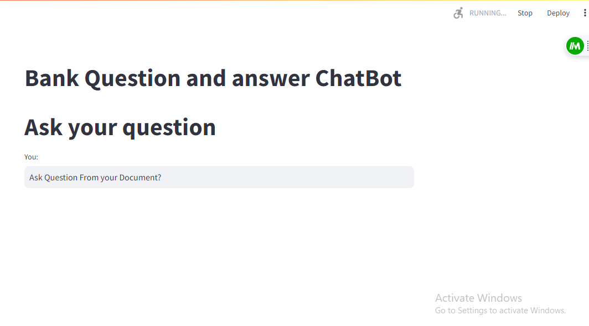

# Bank QnA Chatbotusing Langcahin

Here I have made a Bank QnA chatbot using langchain and streamlit. 

### Prerequisites

- Python 3.x
- Jupyter Notebook or any compatible environment
- Visual Studio code

### Installation

1. Clone the repository:

```bash
git clone https://github.com/S18-Niloy/Bank_QnA_Chatbot_Langchain.git
```
2. Install dependencies:
```
pip install -r requirements.txt
```
3. Specify path:
```
cd model
```
3. Run the model:
```
streamlit run Model.py
```

# Interface: 

  

